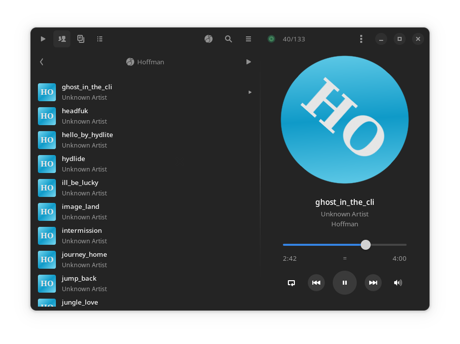
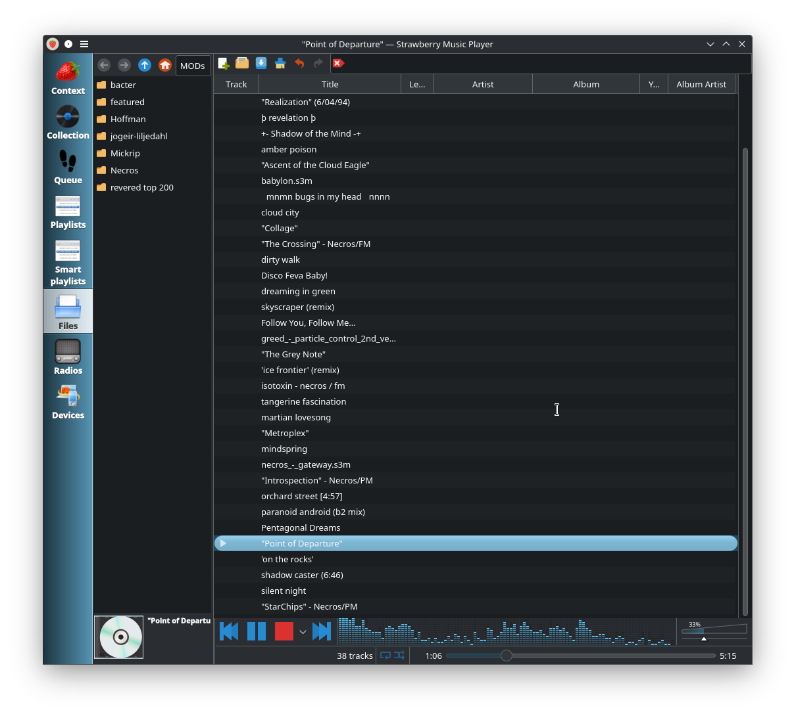

# org.freedesktop.Platform.GStreamer.openmpt

Flatpak extension to add tracker music support to GStreamer-based applications via OpenMPT.

<div style="display: flex">


</div>

This extension contains the `openmpt` plugin from [`gst-plugins-bad`](https://gitlab.freedesktop.org/gstreamer/gstreamer/-/tree/main/subprojects/gst-plugins-bad) and its [`libopenmpt`](https://lib.openmpt.org/libopenmpt/) dependency.

> :information_source: Tracker files only have a title field! Other fields not being populated is not a bug in this or the upstream module.

## Install

This is available on [Flathub](https://flathub.org/apps/org.freedesktop.Platform.GStreamer.openmpt)!

```sh
flatpak install flathub org.freedesktop.Platform.GStreamer.openmpt//24.08
```

Libopenmpt versions across org.fd.Platform releases:

| Runtime version               | libopenmpt version |
| ----------------------------- | ------------------ |
| `org.fd.Platform//21.08` [^1] | 0.7.2              |
| `org.fd.Platform//22.08`      | 0.7.3              |
| `org.fd.Platform//23.08`      | 0.7.13             |
| `org.fd.Platform//24.08`      | 0.8.3              |

[^1]: 21.08 branch support needs to be build manually from the previous repo at [`detjensrobert/org.freedesktop.Platform.GStreamer.openmpt`](https://github.com/detjensrobert/org.freedesktop.Platform.GStreamer.openmpt).
